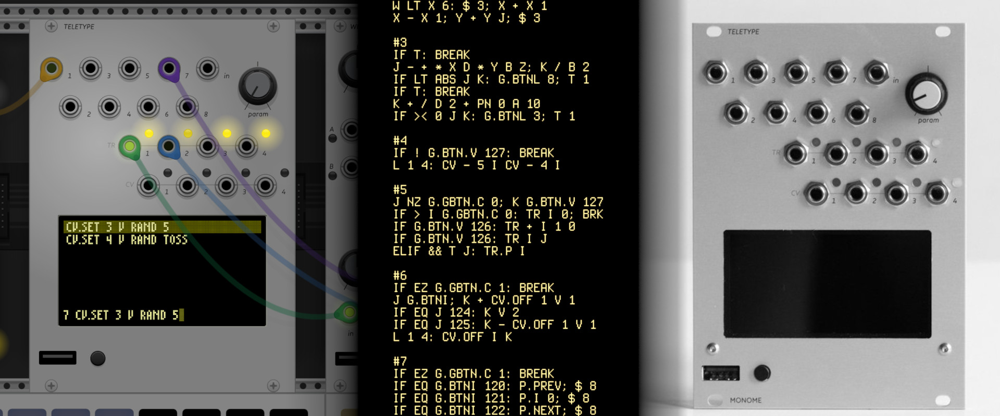

# Scenes For Monome Teletype

Where I keep my cheeky little scripts that make noise.

------------------------------------------------------------------------------

## What is in this here repository?

This is where I stash all the Teletype scenes I make that I feel are worth
keeping. You can find one-off experiments in composition, Teletype haikus, grid
controllers, and more. For a full listing of each scene, dive into the specific
subdirectories and look through the README files there.

The scenes should work with the hardware version of the Teletype, but I haven't
tested them with it since I use the [VCV Rack
version](https://github.com/Dewb/monome-rack). If you encounter an issue with
any of the scenes using hardware, feel free to submit an issue and I'll look
into fixing it.

## But what even is a Teletype?

If you're asking yourself that, then I'm afraid this repository will be pretty
worthless to you. But if you're into modular synthesis and willing to tinker
with some scripting, go ahead and check out the official documentation for the
module over on [Monome's website](https://monome.org/docs/teletype/).

If you've still got some questions, or you want to learn more about how the
community uses the Teletype, check out the [Lines forum](https://llllllll.co/).

## So what do I do now?

Make some noise.
